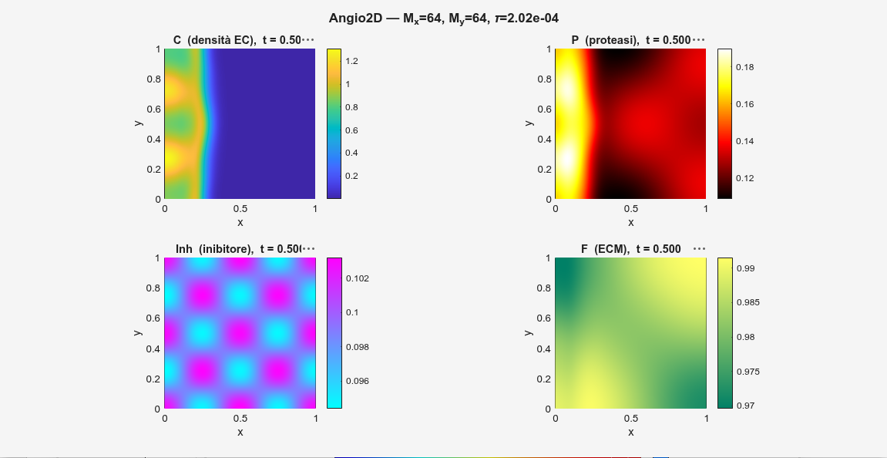
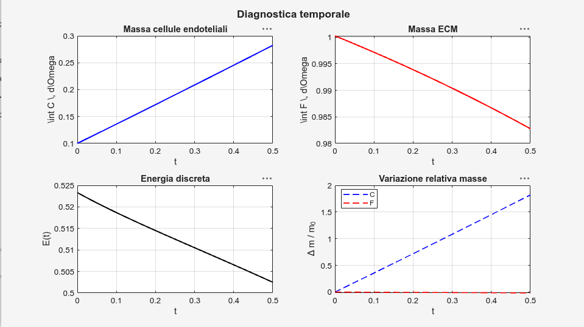
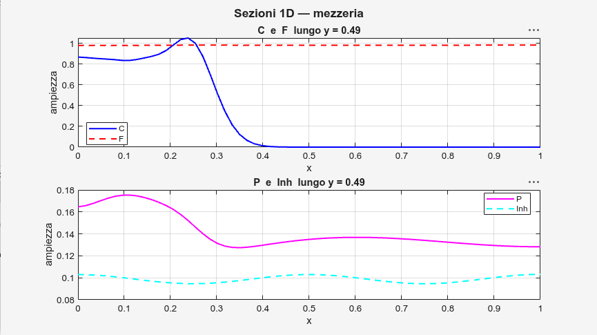
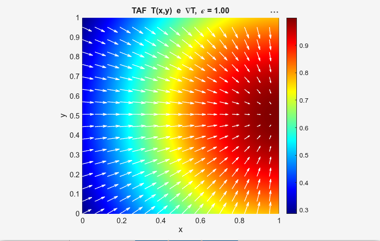

# Interpretazione Output — Modello 2D di Angiogenesi Tumorale

Guida all'interpretazione dei risultati della simulazione numerica del modello PDE di angiogenesi tumorale in 2D.

## Variabili simulate

| Campo | Descrizione |
|-------|-------------|
| `C(x,y,t)` | Densità di cellule endoteliali |
| `P(x,y,t)` | Concentrazione di proteasi |
| `I(x,y,t)` | Concentrazione di inibitore |
| `F(x,y,t)` | Densità della matrice extracellulare (ECM) |
| `T(x,y)` | Campo TAF — Tumor Angiogenic Factor (assegnato) |

## Parametri del modello

```matlab
p.Lx = 1;  p.Ly = 1;
p.Mx = 64; p.My = 64;
p.Tf = 0.5;

p.dC = 0.001; p.dP = 0.001; p.dI = 0.001;

p.alpha1 = 0.4;
p.alpha2 = 0.3;
p.alpha3 = 0.5;
p.alpha4 = 0.1;

p.k1 = 0.1; p.k2 = 0.3; p.k3 = 0.2;
p.k4 = 0.4; p.k5 = 0.1; p.k6 = 0.2;

p.epsilon   = 1.0;
p.C0        = 1.0;
p.a         = 0.1;
p.sigma_IC  = 0.02;
```

## Regime dinamico

Con i parametri di default il sistema si trova in un regime a:

- **diffusione debole** — `dC = dP = dI = 0.001`
- **trasporto tattico dominante** — `alpha3 = 0.5` è il termine guida
- **crescita cellulare moderata** — crescita logistica con `k1 = 0.1`
- **degradazione ECM progressiva** — mediata dalle proteasi
- **fase transiente** — il tempo finale `Tf = 0.5` è breve rispetto alle scale di reazione

---

## Figura 1 — Campi 2D



### Cellule endoteliali `C`

Il profilo iniziale è sigmoide:

```
C(x,0) = (C0/2) * (1 − tanh((x − a) / σ))
```

Il fronte è netto vicino a `x ≈ 0.1`. La diffusione è molto debole, quindi il fronte non si allarga nel tempo ma migra verso destra seguendo il gradiente del TAF. La chemotassi (alpha3) è il termine dominante; la crescita logistica (k1) incrementa localmente la massa cellulare.

### Proteasi `P`

La produzione segue:

```
∂P/∂t = k4·T·C + k5·T − k6·P
```

- `k4 = 0.4` produce proteasi dove `C` e `T` coesistono (zona biologicamente attiva)
- `k5 = 0.1` mantiene una produzione basale proporzionale al TAF
- `k6 = 0.2` bilancia con un decadimento moderato

Il campo `P` è elevato nelle regioni di sovrapposizione tra fronte cellulare e TAF, senza collassare: il sistema è in equilibrio dinamico tra produzione e decadimento.

### Inibitore `I`

```
∂I/∂t = −k3·P·I
```

Con `k3 = 0.2` il consumo è moderato. La bassa diffusione preserva il pattern iniziale. Il sistema è ancora in fase transiente: le reazioni non hanno avuto tempo sufficiente per dominare completamente il campo.

### ECM `F`

```
∂F/∂t = −k2·P·F
```

Con `k2 = 0.3` la degradazione è lenta. Il campo `F` resta prossimo a 1 su gran parte del dominio; l'erosione è visibile solo dove le proteasi sono più concentrate.

---

## Figura 2 — Diagnostica temporale



| Quantità | Andamento | Interpretazione |
|----------|-----------|-----------------|
| Massa `C` | crescente | proliferazione logistica biologicamente realistica |
| Massa `F` | decrescente (lenta) | effetto cumulativo delle proteasi sull'ECM |
| Energia discreta | decrescente | sistema dissipativo; schema ADI + splitting stabile |

---

## Figura 3 — Sezioni 1D lungo `y = Ly/2`



**`C` vs `F`** — il fronte netto di `C` corrisponde a un calo localizzato di `F`: invasione cellulare accompagnata da degradazione della matrice.

**`P` vs `I`** — `P` cresce dove `C` è alta; `I` cala localmente nelle stesse zone. Conferma l'interazione non lineare accoppiata tra i quattro campi.

---

## Figura 4 — Campo TAF e gradiente



Il TAF è assegnato come:

```
T(x,y) = exp(−ε⁻¹ · ((x − Lx)² + (y − Ly/2)²))
```

Il massimo è localizzato nell'angolo destro del dominio (`x = Lx`, `y = Ly/2`). Con `ε = 1.0` la distribuzione è ampia. Il gradiente ∇T punta verso il tumore ed è la guida principale della migrazione cellulare.

---

## Ruolo dei parametri

**Diffusione** — `dC`, `dP`, `dI` piccoli producono fronti netti e poco dispersi.

**Taxis** — `alpha3` è il coefficiente dominante (chemotassi verso TAF); `alpha1` e `alpha2` introducono effetti secondari di aptotassi e chemorepulsione.

**Reazioni**

| Parametro | Effetto |
|-----------|---------|
| `k1` | crescita logistica cellule |
| `k2` | velocità di degradazione ECM |
| `k3` | consumo di inibitore da parte delle proteasi |
| `k4`, `k5` | produzione di proteasi (dipendente da C·T e T) |
| `k6` | decadimento delle proteasi |

---

## Stabilità numerica

Il passo temporale è determinato dalla condizione CFL avvettiva. La diffusione è trattata implicitamente con schema ADI, che garantisce stabilità incondizionata sul passo diffusivo. Il decremento dell'energia discreta a ogni passo è la verifica numerica della stabilità globale.

---

## Interpretazione globale

Il sistema si trova in un regime a diffusione debole e trasporto tattico dominante. La chemotassi verso il TAF, controllata principalmente da `alpha3`, guida la migrazione delle cellule endoteliali verso la regione tumorale. La crescita logistica incrementa la massa cellulare, mentre la produzione di proteasi induce una degradazione progressiva della matrice extracellulare. L'inibitore viene consumato localmente ma il sistema resta in fase transiente. La diminuzione dell'energia discreta conferma la stabilità dello schema numerico.

---

## Esperimenti suggeriti

- **Aumentare `alpha3`** → migrazione più direzionata verso il tumore
- **Aumentare `k2`** → degradazione ECM più rapida, erosione visibile prima
- **Aumentare `dC`** → fronte cellulare più diffuso, perdita della nitidezza del profilo sigmoide
