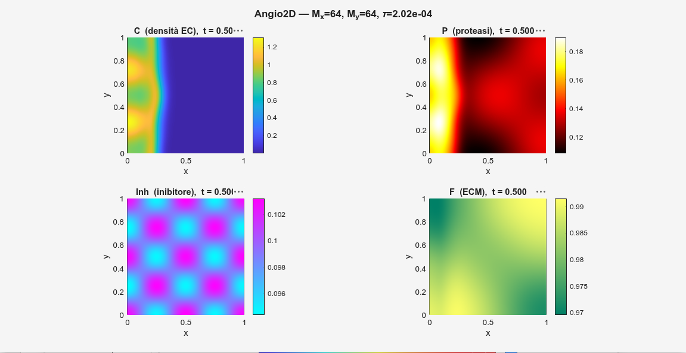
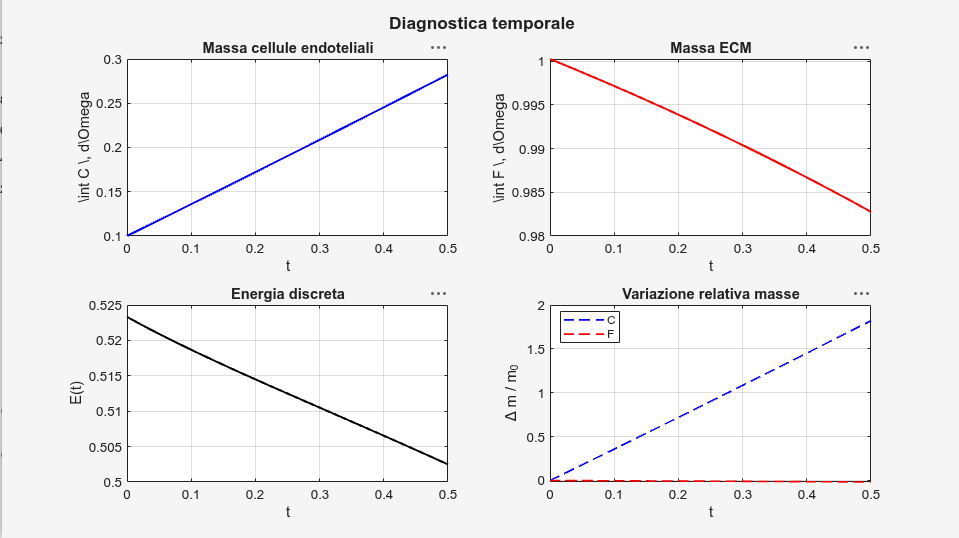
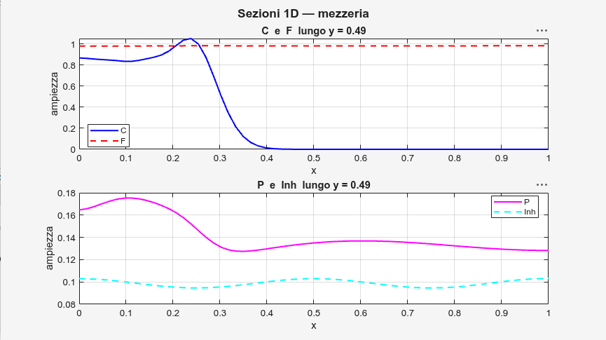
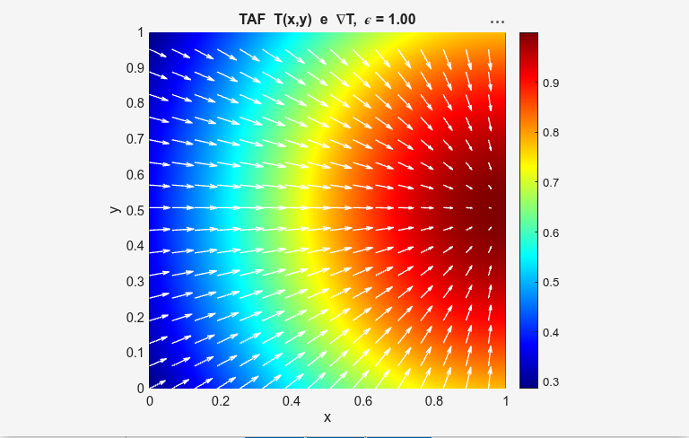

# Output Interpretation — 2D Tumor Angiogenesis Model

Guide to interpreting the results produced by the 2D PDE angiogenesis model simulations.

## Simulated variables

| Field | Description |
|-------|-------------|
| `C(x,y,t)` | Endothelial cell density |
| `P(x,y,t)` | Protease concentration |
| `I(x,y,t)` | Inhibitor concentration |
| `F(x,y,t)` | Extracellular matrix (ECM) density |
| `T(x,y)` | TAF field — Tumor Angiogenic Factor (prescribed) |

## Model parameters

```matlab
p.Lx = 1;  p.Ly = 1;
p.Mx = 64; p.My = 64;
p.Tf = 0.5;

p.dC = 0.001; p.dP = 0.001; p.dI = 0.001;

p.alpha1 = 0.4;
p.alpha2 = 0.3;
p.alpha3 = 0.5;
p.alpha4 = 0.1;

p.k1 = 0.1; p.k2 = 0.3; p.k3 = 0.2;
p.k4 = 0.4; p.k5 = 0.1; p.k6 = 0.2;

p.epsilon   = 1.0;
p.C0        = 1.0;
p.a         = 0.1;
p.sigma_IC  = 0.02;
```

## Dynamical regime

With the default parameters the system lies in a regime characterized by:

- **weak diffusion** — `dC = dP = dI = 0.001`
- **dominant taxis/transport** — `alpha3 = 0.5` is the leading term
- **moderate cell growth** — logistic growth with `k1 = 0.1`
- **progressive ECM degradation** — mediated by proteases
- **transient phase** — final time `Tf = 0.5` is short compared to reaction scales

---

## Figure 1 — 2D fields



### Endothelial cells `C`

The initial profile is sigmoidal:

```
C(x,0) = (C0/2) * (1 − tanh((x − a) / σ))
```

The front is sharp near `x ≈ 0.1`. Diffusion is very weak, so the front does not spread over time but migrates rightwards following the TAF gradient. Chemotaxis (alpha3) is the dominant driver; logistic growth (k1) increases local cell mass.

### Proteases `P`

Production follows:

```
∂P/∂t = k4·T·C + k5·T − k6·P
```

- `k4 = 0.4` produces proteases where `C` and `T` coexist (biologically active zone)
- `k5 = 0.1` provides a baseline production proportional to TAF
- `k6 = 0.2` balances production with moderate decay

The field `P` peaks in regions where the cell front overlaps with the TAF; the system reaches a dynamical balance between production and decay.

### Inhibitor `I`

```
∂I/∂t = −k3·P·I
```

With `k3 = 0.2` the consumption is moderate. Low diffusion preserves the initial pattern. The system remains transient: reactions have not yet fully settled the fields.

### ECM `F`

```
∂F/∂t = −k2·P·F
```

With `k2 = 0.3` degradation is slow. The field `F` stays close to 1 across most of the domain; erosion appears only where protease concentration is high.

---

## Figure 2 — Temporal diagnostics



| Quantity | Trend | Interpretation |
|----------|-----------|-----------------|
| Mass `C` | increasing | logistic proliferation, biologically plausible |
| Mass `F` | decreasing (slow) | cumulative ECM degradation by proteases |
| Discrete energy | decreasing | dissipative system; ADI + splitting scheme is stable |

---

## Figure 3 — 1D slices along `y = Ly/2`



**`C` vs `F`** — the sharp `C` front corresponds to a localized drop in `F`: cellular invasion accompanied by ECM degradation.

**`P` vs `I`** — `P` increases where `C` is high; `I` decreases locally in the same regions. This confirms the coupled nonlinear interaction between the four fields.

---

## Figure 4 — TAF field and gradient



The TAF is prescribed as:

```
T(x,y) = exp(−ε⁻¹ · ((x − Lx)² + (y − Ly/2)²))
```

The maximum is located near the right corner of the domain (`x = Lx`, `y = Ly/2`). With `ε = 1.0` the distribution is wide. The gradient ∇T points toward the tumor and is the main guide for cell migration.

---

## Role of parameters

**Diffusion** — small `dC`, `dP`, `dI` produce sharp, non-diffusive fronts.

**Taxis** — `alpha3` is the dominant chemotactic coefficient toward TAF; `alpha1` and `alpha2` introduce secondary haptotaxis and chemorepulsion effects.

**Reactions**

| Parameter | Effect |
|-----------|---------|
| `k1` | logistic cell growth |
| `k2` | ECM degradation rate |
| `k3` | inhibitor consumption by proteases |
| `k4`, `k5` | protease production (dependent on C·T and T) |
| `k6` | protease decay |

---

## Numerical stability

The time step is set according to the advective CFL condition. Diffusion is handled implicitly via an ADI scheme, which ensures unconditional stability for the diffusive part. The monotonic decrease of the discrete energy at each step is used as a numerical check of global stability.

---

## Global interpretation

The system is in a weak-diffusion, transport-dominated regime. Chemotaxis toward the TAF, mainly controlled by `alpha3`, drives endothelial cell migration toward the tumor region. Logistic growth increases cell mass, while protease production triggers progressive ECM degradation. The inhibitor is consumed locally and the system remains transient. The decrease in discrete energy confirms numerical stability of the scheme.

---

## Suggested experiments

- **Increase `alpha3`** → more directed migration toward the tumor
- **Increase `k2`** → faster ECM degradation; earlier visible erosion
- **Increase `dC`** → more diffuse cell front, loss of sharp sigmoidal profile
